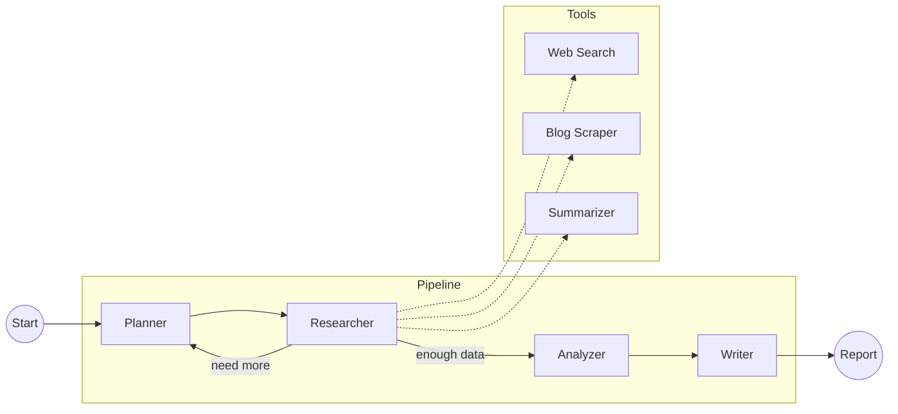

# 🔬 Agentic Research Assistant

A multi-agent research assistant powered by **LangGraph** that researches any topic using web search, blog scraping, and LLM-powered analysis.

## Architecture



### 🤖 Agents

| Agent | Description |
|-------|-------------|
| **📋 Planner** | Analyzes the topic and generates a research strategy — sub-questions to answer, optimized search queries, and URLs to scrape |
| **🔍 Researcher** | Executes the plan by running web searches, scraping blog posts, and summarizing long-form content. Loops back to the Planner if data is insufficient (up to N iterations) |
| **🔬 Analyzer** | Synthesizes all collected sources into a structured analysis — identifies key themes, recurring patterns, contradictions, and knowledge gaps |
| **📝 Writer** | Transforms the analysis into a polished, publication-ready markdown report with executive summary, detailed findings, and numbered citations |

### 🛠️ Tools

| Tool | Description |
|------|-------------|
| **🌐 Web Search** | Searches via [Tavily](https://tavily.com) API; automatically falls back to DuckDuckGo if no API key is set |
| **📄 Blog Scraper** | Fetches and extracts main content from any URL using semantic HTML parsing (BeautifulSoup) |
| **✂️ Summarizer** | LLM-powered summarization that condenses long articles while focusing on the research topic |

## Setup

### 1. Create a virtual environment

```bash
python -m venv venv

# Activate it:
# Windows
.\venv\Scripts\activate

# macOS / Linux
source venv/bin/activate
```

### 2. Install dependencies

```bash
pip install -e .
```

### 3. Configure API keys

```bash
cp .env.example .env
# Edit .env and add your API keys
```

**Required:** `OPENAI_API_KEY`  
**Optional:** `TAVILY_API_KEY` (falls back to DuckDuckGo if not set)

### 3. Run

**CLI:**
```bash
python main.py --topic "Your research topic"
python main.py --topic "LLM Agents" --blogs "https://blog1.com,https://blog2.com"
python main.py --topic "RAG techniques" --output my_report.md
```

**Streamlit UI:**
```bash
streamlit run app.py
```

## Project Structure

```
research_assistant/
├── main.py              # CLI entry point
├── app.py               # Streamlit web UI
├── pyproject.toml       # Dependencies
├── .env.example         # API key template
├── src/
│   ├── state.py         # LangGraph shared state schema
│   ├── config.py        # LLM factory & configuration
│   ├── graph.py         # LangGraph workflow definition
│   ├── tools/
│   │   ├── web_search.py    # Tavily / DuckDuckGo search
│   │   ├── blog_scraper.py  # URL content extraction
│   │   └── summarizer.py    # LLM-powered summarization
│   └── agents/
│       ├── planner.py       # Research plan generation
│       ├── researcher.py    # Data collection agent
│       ├── analyzer.py      # Source analysis agent
│       └── writer.py        # Report generation agent
└── output/              # Generated reports
```

## Configuration

| Environment Variable | Default | Description |
|---------------------|---------|-------------|
| `OPENAI_API_KEY` | — | OpenAI API key (required) |
| `TAVILY_API_KEY` | — | Tavily search API key (optional) |
| `LLM_MODEL` | `gpt-4o-mini` | LLM model to use |
| `LLM_TEMPERATURE` | `0.2` | LLM temperature |
| `MAX_ITERATIONS` | `2` | Max planner→researcher loops |
| `MAX_SEARCH_RESULTS` | `5` | Results per search query |
| `MAX_SCRAPE_LENGTH` | `8000` | Max chars to extract per page |
